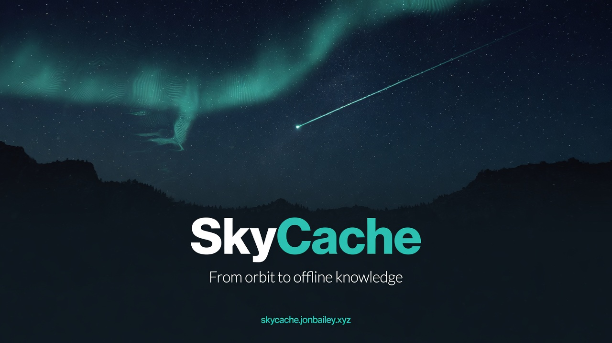

# SkyCache Nexus  |  Skybrary

<p align="center">
  
</p>

<p align="center">
  <strong>From orbit to offline knowledge</strong>  |  Community fabric  |  <strong>Skybrary</strong> mission<br/>
  <a href="https://skycache.jonbailey.xyz">skycache.jonbailey.xyz</a>
   |  <a href="https://skycache.jonbailey.xyz/skybrary/">Skybrary plan</a>
</p>

**SkyCache** receives public free-to-air / open satellite information (and USB education packs), prioritizes what matters, replicates across a local unlicensed Wi-Fi mesh, and serves a store-and-forward portal for schools, clinics, villages, and disaster zones.

**Skybrary (the Sky Library)** is the long-horizon mission on this foundation: a resilient, legal, dual-access archive of *open* written knowledge - online for the connected, offline packs for the rest. North star, not a claim of completeness: see [`docs/VISION-SKYBRARY.md`](docs/VISION-SKYBRARY.md).

> **Legal (non-negotiable):** SkyCache is **receive-only** for satellite/RF reception and only targets **unencrypted free-to-air**, public, or **openly licensed** content. Mesh transmit uses **unlicensed/ISM** Wi-Fi (and optional regional LoRa for control). It is **not** free Starlink/OneWeb/commercial VSAT broadband, and it will not help decrypt paid services. Operators must check local spectrum and Wi-Fi regulations. Full policy: [`docs/legal-ethics.md`](docs/legal-ethics.md).


## What it is

| Does | Does not |
|------|----------|
| Cache weather, education, health, emergency packs | Provide free commercial broadband or Starlink |
| Serve phones over local hotspot + **multi-node mesh** | Decrypt commercial satellite constellations |
| Prioritize Emergency -> Health -> Education under pressure | Require cloud accounts or personal-data harvesting |
| **DTN** queues, USB data-mules, opportunistic open pulls | Satellite uplink by default |
| Run full **multi-node simulation** with zero RF hardware | Replace SatDump / Kiwix - it orchestrates them |

## Quick start (simulation - no satellite needed)

```bash
# From the SkyCache directory
python -m pip install -e ".[dev]"
python scripts/make_sample_package.py
python -m skycache first-boot --data-dir data --yes --pin 739184 \
  --ssid SkyCache-Sim --legal-rf-mode receive_only --sim
python -m skycache serve --sim --host 127.0.0.1 --port 8080
```

Open **http://127.0.0.1:8080/** - icon portal with sample Emergency, Health, Education, Farm, Weather, Maps, and Skybrary Library content.

**Village / Pi golden path** (&lt;2 hours): [`docs/first-boot.md`](docs/first-boot.md)  |  `sudo bash deploy/install-village-fabric.sh`

```bash
python -m skycache doctor
python -m skycache capabilities
python -m skycache nexus doctor
python -m skycache nexus sim --nodes 3 --disaster
python -m skycache nexus validate --nodes 2
python -m skycache skybrary pack --profile literacy-1gb
python -m skycache skybrary export-catalog --out data/catalog-export --starter-kits
python -m skycache pi-image bundle --out data/pi-download
python -m skycache rx doctor
python -m skycache rx watch --dir /path/to/satdump/products --once
python -m skycache mesh dual-radio-pack --out media/dual-radio-validation
python -m skycache handoff doctor
python -m skycache handoff join-card --portal-url http://10.42.0.1:8080/ --ssid SkyCache-Village
python -m skycache handoff export --limit 10
python -m skycache gateway doctor
python -m skycache gateway pull-preset gutenberg-sample --dry-run
python -m skycache gateway pull-preset gutenberg-sample --sim
python -m skycache village-day doctor
python -m skycache village-day readiness
python -m skycache village-day kit --out data/village-day-kit
python -m skycache federation doctor
python -m skycache federation sim --nodes 2
python -m skycache federation kit --out data/federation-kit
python -m skycache integrity doctor
python -m skycache integrity verify --record
python -m skycache integrity kit --out data/integrity-kit
python -m skycache disaster doctor
python -m skycache disaster run --nodes 3
python -m skycache disaster closeout
python -m skycache disaster kit --out data/disaster-kit
python -m skycache power doctor
python -m skycache power sheet --out data/ops/power-sheet.html
python -m skycache power kit --out data/power-kit
python -m skycache licenses doctor
python -m skycache licenses export --out data/ops/licenses-inventory.html
python -m skycache licenses kit --out data/licenses-kit
python -m skycache capabilities doctor
python -m skycache capabilities status
python -m skycache capabilities export --out data/ops/capabilities-matrix.html
python -m skycache capabilities kit --out data/capabilities-kit
python -m skycache ops doctor
python -m skycache ops status
python -m skycache ops export --out data/ops/local-ops-board.html
python -m skycache ops kit --out data/ops-kit
python -m skycache rx doctor
python -m skycache rx status
python -m skycache rx export --out data/ops/rx-station-board.html
python -m skycache rx kit --out data/rx-kit
python -m skycache report doctor
python -m skycache report status
python -m skycache report export --out data/ops/node-report.html
python -m skycache report kit --out data/report-kit
python -m skycache corpus doctor
python -m skycache corpus status
python -m skycache corpus export --out data/ops/corpus-board.html
python -m skycache corpus kit --out data/corpus-kit
python -m skycache seal doctor
python -m skycache seal status
python -m skycache seal export --out data/ops/seal-board.html
python -m skycache seal kit --out data/seal-kit
python -m skycache dual-radio doctor
python -m skycache dual-radio status
python -m skycache dual-radio export --out data/ops/dual-radio-board.html
python -m skycache dual-radio kit --out data/dual-radio-kit
python -m skycache partner doctor
python -m skycache partner status
python -m skycache partner export --out data/ops/partner-board.html
python -m skycache partner ops-kit --out data/partner-ops-kit
python -m skycache skybrary import-gutenberg-catalog --catalog path/to/catalog.json --allow-local --dry-run
python -m pytest -q
```

**v0.9.0 Skybrary Live:** dual-access online portal complete, curated PD corpus (~18 works), Gutenberg catalog adapter, starter kits with license passports, public `/library/` overhaul - see [`CHANGELOG.md`](CHANGELOG.md)  |  https://skycache.jonbailey.xyz/library/

Windows: use `py -3` instead of `python` if needed.

## Architecture (high level)

```text
Antenna/SDR (RX only) -> decoder plugins -> ingest + prioritizer -> SQLite + packages
                              ↓
                    Nexus fabric (mesh gossip, DTN, gateway quotas)
                              ↓
              FastAPI + multi-language PWA ← Wi-Fi AP / batman-adv mesh
```

Details: [`docs/architecture.md`](docs/architecture.md)  |  Mesh field guide: [`docs/mesh-deployment.md`](docs/mesh-deployment.md)  |  Village recipe: [`docs/village-nexus-playbook.md`](docs/village-nexus-playbook.md).

## Roadmap (chronological)

| Phase | Goal |
|-------|------|
| **0** | Simulation/demo with sample packages |
| **1** | File ingest, package create/validate, USB drop watch, hotspot enable - [`docs/phase1-file-ingest.md`](docs/phase1-file-ingest.md) |
| **2** | Live FTA weather via SatDump on RTL-SDR - [`docs/phase2-live-rx.md`](docs/phase2-live-rx.md) |
| **3** | Full prioritization ops, power sensors, DTN-lite messaging |
| **4 Nexus** | Multi-node mesh, content fabric, opportunistic gateway, disaster mode, village playbooks |
| **4.0 Community UX** | Search, boards, ratings, license inventory, power/traffic monitors, onboarding |
| **S0 - S1 Skybrary** | Mission docs + architecture + PD sample scaffold |
| **S2 Skybrary** | Works FTS catalog, Library tab, facets |
| **0.6 Legal surface** | Full capability matrix, open fetch, pack profiles, verify, handoff |
| **0.7 Village + dual-access** | First-boot, PWA reader, USB kits, handoff UI, corpus import, passport, federation E2E  |  [NEXT-STEPS](docs/NEXT-STEPS.md) |
| **0.7.1 Phone offline demos** | No cell plan: hub Wi-Fi -> **Save demos to this phone** (3 PD texts zip)  |  [phone-offline-demo](docs/phone-offline-demo.md) |
| **0.7.2 Zero-network kit** | No Wi-Fi **and** no cell: USB/SD/BT/pre-deploy -> open `READ-OFFLINE.html`  |  [zero-network-phone](docs/zero-network-phone.md) |
| **0.8 Village Ready** | Signed pack kits 2.0, power sheets, gateway ethics, mesh validate, dual-access catalog export, partner kits  |  [CHANGELOG](CHANGELOG.md) |
| **0.9 Skybrary Live** | Dual-access portal complete, curated PD corpus, Gutenberg catalog adapter, starter kits + passports, site /library/ overhaul - [CHANGELOG](CHANGELOG.md) |
| **0.9.1 Field depth** | Pi bake plan, batman day-one OOB, OA science import, chapters/EPUB spine, blob store, maps-offline, partner kits - [CHANGELOG](CHANGELOG.md) |
| **0.9.2 Depth complete** | Golden SD kit hosting, dual-radio validation media, MBTiles via blob store, CSS pagination reader - [CHANGELOG](CHANGELOG.md) |
| **1.0 Resilience Fabric** | Scheduled bit-rot doctor, multi-node works federation sim, local ops metrics, threat-model one-pager - [CHANGELOG](CHANGELOG.md) |
| **1.0.1 Compact gossip** | Bandwidth-aware compact works_manifest + locale status parity - [CHANGELOG](CHANGELOG.md) |
| **1.1 Live FTA RX Ops** | SatDump product watch, RX doctor, station/passes, field log, recipes - [CHANGELOG](CHANGELOG.md) |
| **1.1.1 Windows RX setup** | Setup-RxStation / Start-RxWatch / Scheduled Task helpers - [CHANGELOG](CHANGELOG.md) |
| **1.1.2 SatDump/RTL tools** | Install-RxTools-Windows, PATH doctor, live_decode + rtl_device_seen - [CHANGELOG](CHANGELOG.md) |
| **1.2 Pass Autopilot** | schedule/arm/cmd/duty, SatDump sketches, watch auto field-log - [CHANGELOG](CHANGELOG.md) |
| **1.3 Partner Pilot Ops** | partner kit zip/package-all, report validate, readiness score, /partners/ - [CHANGELOG](CHANGELOG.md) |
| **1.4 Golden Node Bake Ops** | pi-image doctor/seal/sealed-manifest, kit zip v2, /install/ - [CHANGELOG](CHANGELOG.md) |
| **1.5 Bulk Open Corpus Ops** | corpus doctor/status/batch manifests, legal bulk scale - [CHANGELOG](CHANGELOG.md) |
| **1.6 Field Mesh Ops** | mesh doctor/readiness/disaster-drill/field-kit, /mesh/ - [CHANGELOG](CHANGELOG.md) |
| **1.7 Phone Handoff Ops** | handoff doctor/join-card QR/export/import, /handoff/ - [CHANGELOG](CHANGELOG.md) |
| **1.8 Gateway Ops** | gateway doctor/presets/pull-preset+passport/receipts/ethics-kit, /gateway/ - [CHANGELOG](CHANGELOG.md) |
| **1.9 Village Day Ops** | village-day doctor/readiness/runbook/kit, /village-day/ - [CHANGELOG](CHANGELOG.md) |
| **1.10 Federation Ops** | federation doctor/sim/export-gossip/kit, /federation/ - [CHANGELOG](CHANGELOG.md) |
| **1.11 Integrity Ops** | integrity doctor/verify/report/kit, /integrity/ - [CHANGELOG](CHANGELOG.md) |
| **1.12 Disaster Drill Ops** | disaster doctor/run/report/closeout/kit, /disaster/ - [CHANGELOG](CHANGELOG.md) |
| **1.13 Power Ops** | power doctor/status/sheet/kit, /power/ - [CHANGELOG](CHANGELOG.md) |
| **1.14 Licenses Ops** | licenses doctor/status/export/kit, /licenses/ - [CHANGELOG](CHANGELOG.md) |
| **1.15 Capabilities Ops** | capabilities doctor/status/export/kit, /capabilities/ - [CHANGELOG](CHANGELOG.md) |
| **1.16 Local Ops** | ops doctor/status/export/kit, /ops/ (fleet heartbeat OFF) - [CHANGELOG](CHANGELOG.md) |
| **1.17 RX Ops** | rx doctor/status/export/kit, /rx/ (receive-only FTA) - [CHANGELOG](CHANGELOG.md) |
| **1.18 Node Report Ops** | report doctor/status/export/kit, /report/ (partner passport) - [CHANGELOG](CHANGELOG.md) |
| **1.19 Corpus Ops** | corpus doctor/status/export/kit, /corpus/ kit - [CHANGELOG](CHANGELOG.md) |
| **1.20 Seal Ops** | seal doctor/status/export/kit, /install/ seal kit - [CHANGELOG](CHANGELOG.md) |
| **1.21 Partner Ops** | partner doctor/status/export/ops-kit, /partners/ - [CHANGELOG](CHANGELOG.md) |
| **1.22 Dual Radio Ops** | dual-radio doctor/status/export/kit, /mesh/ dual-radio kit - [CHANGELOG](CHANGELOG.md) |
| **1.23 Skybrary PD Expand** | curated PD library 18 -> 44 works, /library/ catalog fatten - [CHANGELOG](CHANGELOG.md) |
| **1.24 Library Ops + ML PD** | library doctor/status/board/kit + API; 44 -> 52 works (multilingual wave) - [CHANGELOG](CHANGELOG.md) |
| **1.25 Library Publish + ML2** | library publish catalog for marketing; 52 -> 58 works (ar/sw/hi/ja/yo/bn) - [CHANGELOG](CHANGELOG.md) |
| **1.26 Zero-Network Parity** | library zero-network kit matches full curated sample count; doctor parity check - [CHANGELOG](CHANGELOG.md) |
| **1.27 Library Sync** | one-shot library sync staging for marketing site (catalog + kits) - [CHANGELOG](CHANGELOG.md) |
| **1.28 Apply-Web + ML pack** | library sync --apply-web; multilingual-literacy pack profile - [CHANGELOG](CHANGELOG.md) |
| **1.29 Pack kits** | library pack-kits + sync --with-packs for USB pack zips on marketing site - [CHANGELOG](CHANGELOG.md) |
| **1.30 Clinic packs** | pack-kits default includes emergency-health + health-priority zips - [CHANGELOG](CHANGELOG.md) |
| **1.31 Health corpus** | +10 educational health/emergency PD samples; fatter clinic packs - [CHANGELOG](CHANGELOG.md) |
| **1.32 Zero-network 68** | zero-network kit parity at 68 works; zip self-include guard; doctor 100 - [CHANGELOG](CHANGELOG.md) |
| **1.33 Open Resilience** | STEM/civics corpus 78 works; disaster prioritizer; open_fta_sim plugin; archive pack budgets - **current** - [CHANGELOG](CHANGELOG.md) |

## Tech stack

- **Python 3.11+**, FastAPI, SQLite, static multi-language PWA  
- **Plugins** wrap [SatDump](https://www.satdump.org/), [gr-satellites](https://github.com/daniestevez/gr-satellites), file/ZIM import  
- Mesh: **batman-adv** hooks + in-process sim; hotspot hostapd + dnsmasq  
- Inspired by SatNOGS, TinyGS, Kiwix, Internet-in-a-Box/RACHEL, community networks (see [`docs/open-sources.md`](docs/open-sources.md))

## Repository layout

```text
skycache/          # Python package (CLI, pipelines, web, policy, nexus/)
webui/             # Mobile-first PWA (i18n: en fr es ar sw hi pt)
samples/packages/  # Demo content
deploy/            # systemd, hotspot, Debian installer, village fabric notes
docs/              # Architecture, legal, mesh deploy, BOM, playbooks
tests/             # pytest (including multi-node Nexus sim)
```

## Hardware

Ultra-low-cost target: **RTL-SDR + Raspberry Pi/Orange Pi + commodity Wi-Fi APs**, optional LoRa for control plane, optional solar.  
BOM: [`docs/hardware-bom.md`](docs/hardware-bom.md) (~$90 - 180 MVP without solar; multi-node scales with extra Pis/APs).

## Documentation

| Doc | Audience |
|-----|----------|
| [`docs/legal-ethics.md`](docs/legal-ethics.md) | Everyone - **read first** |
| [`docs/mesh-deployment.md`](docs/mesh-deployment.md) | Mesh / spectrum / multi-node |
| [`docs/mesh-field-checklist.md`](docs/mesh-field-checklist.md) | Printable 2-node day checklist |
| [`docs/disaster-drill.md`](docs/disaster-drill.md) | Disaster mode drill + partner checklist |
| [`docs/village-nexus-playbook.md`](docs/village-nexus-playbook.md) | Field install recipe |
| [`docs/first-boot.md`](docs/first-boot.md) | **Golden path** - demo node in &lt;2 hours |
| [`docs/phone-offline-demo.md`](docs/phone-offline-demo.md) | **Phone, no cell plan** - download 3 demos over hub Wi-Fi only |
| [`docs/zero-network-phone.md`](docs/zero-network-phone.md) | **No Wi-Fi, no cell** - USB/SD/BT kit; open READ-OFFLINE.html offline |
| [`docs/installation.md`](docs/installation.md) | Technical volunteers |
| [`docs/community-playbook.md`](docs/community-playbook.md) | NGOs / local clubs |
| [`docs/training-local-maintainer.md`](docs/training-local-maintainer.md) | Field training |
| [`docs/content-packaging.md`](docs/content-packaging.md) | Content authors |
| [`CHANGELOG.md`](CHANGELOG.md) | Release notes |

## CLI

```text
skycache init [--load-samples]
skycache first-boot --yes --pin NNNN [--ssid] [--legal-rf-mode] [--sim]
skycache serve [--sim] [--host] [--port]
skycache ingest <path>
skycache package create|validate ...
skycache watch [--once]
skycache pipeline --plugin sim_file|satdump_weather|gr_satellites|package_import
skycache status
skycache doctor
skycache mesh status [--compliance]
skycache gateway [--sim] [--request ID] [--pull]
skycache nexus doctor
skycache nexus sim [--nodes 3] [--disaster]
skycache nexus status
skycache search [query]
skycache licenses doctor|status|export|kit
skycache skybrary doctor [--verify]   # --verify: content-tree integrity (bit-rot)
skycache skybrary samples [--ingest]
skycache skybrary search [query]
skycache skybrary pack --profile literacy-1gb|--list
skycache skybrary import-folder DIR --license "public domain" [--ingest]
skycache skybrary import-open URL --license "project gutenberg" [--ingest]
skycache capabilities doctor|status|export|kit   # also bare / --json for matrix
skycache open-fetch URL --out FILE
skycache verify data/content          # same integrity pass; schedule weekly via cron
skycache handoff --out data/handoff
```

Corpus import (legal bulk, operator-run): see [`docs/skybrary-corpus-import.md`](docs/skybrary-corpus-import.md).

**License passport:** `GET /api/packages/{id}/passport` and `GET /api/skybrary/works/{id}/passport` (license, provenance, sha256, redistribute yes/no/review). PWA shows a Passport chip on cards.

**Legal RF mode** (env `SKYCACHE_LEGAL_RF_MODE`): `receive_only` | `ism_mesh` | `ism_lora_control` | `hybrid_gateway` | `amateur_operator` (requires `SKYCACHE_AMATEUR_LICENSE_AFFIRMED=true`).  
Never: commercial decrypt or default satellite uplink.

**Repo:** https://github.com/Pitchfork-and-Torch/SkyCache  
**Site:** https://skycache.jonbailey.xyz

## Contributing

See [`CONTRIBUTING.md`](CONTRIBUTING.md). Please keep the legal rails intact - PRs that add commercial decryption, satellite uplink, or dishonest "free broadband" claims will be rejected.

## License

Apache License 2.0 - see [`LICENSE`](LICENSE) and [`NOTICE`](NOTICE).

## Acknowledgments

Built on open tools and community-network practice. SkyCache Nexus maximizes **what is already legal** for humanitarian impact: education, health, emergency coordination, and local ownership after volunteers leave.

