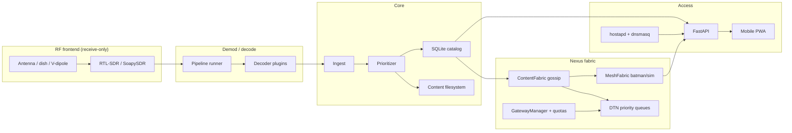
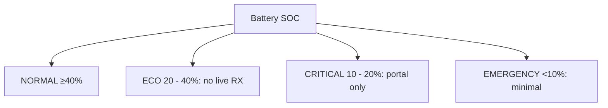

# Architecture

## Overview

SkyCache is a modular **receive -> decode -> prioritize -> store -> serve** system.  
**SkyCache Nexus (Phase 4)** extends isolated hubs into a **multi-node Community Knowledge & Connectivity Fabric**: unlicensed Wi-Fi mesh, DTN store-and-forward, opportunistic legal gateways, and distributed content replication.

**Skybrary (Sky Library)** is the long-horizon archive layer: dual-access open written knowledge (online portal + offline packs) on this foundation - aspirational maximal *feasible* open heritage, never a claim of completeness. See [`VISION-SKYBRARY.md`](VISION-SKYBRARY.md) and [`skybrary-architecture.md`](skybrary-architecture.md).

Honest product model: **local broadband *experience*** + **store-and-forward knowledge** - **not** free commercial satellite internet.



## Layers

1. **Pipelines / plugins** - wrap SatDump, gr-satellites, file import, simulation.  
2. **Content manager** - normalize to package manifests, enforce legal source checks.  
3. **Prioritizer** - emergency/health/education first under disk pressure.  
4. **Catalog** - SQLite index for the portal API.  
5. **Web edge** - FastAPI + static PWA + captive probe redirects.  
6. **Health** - power modes + signal snapshot hooks + **time-to-ECO guidance** (`health/power_guidance.py`).  
7. **Nexus mesh** - `skycache.nexus.mesh` (batman-adv hooks + multi-node sim) + **`nexus validate`** (2/3-node acceptance).  
8. **Nexus DTN** - priority bundles (content, request, message, control) + USB mule.  
9. **Content fabric** - manifest gossip, prioritized replication, disaster flood.  
10. **Opportunistic gateway** - legal uplink detect, fair-share open pulls, daily quotas, **open-mirror presets + local pull receipts**.  
11. **Skybrary archive** - works FTS, pack profiles 2.0 (signed manifests), corpus import, dual-access **catalog export**, provenance reports.

## Power resilience



## Data model

Each content unit is a directory:

```
data/content/<package-id>/
  manifest.json
  index.html | map.png | ...
```

See `content-packaging.md`.

## Nexus package map

```text
skycache/nexus/
  spectrum.py    # allowed bands, compliance report, mode bans
  identity.py    # stable node-id
  mesh.py        # peers, topology, power-prefer routes, batman probe
  dtn.py         # bundle queue + mule import/export
  fabric.py      # gossip + replicate
  gateway.py     # uplink detect + fair-share scheduler
  sim.py         # multi-node in-process fabric simulation
```

CLI: `skycache mesh status`, `skycache gateway [--presets|--receipts|--quota-mb]`,  
`skycache nexus doctor|sim|status|validate`,  
`skycache skybrary pack|export-catalog|provenance`, `skycache licenses --html`.  

API: `/api/nexus/*`, `/api/power/guidance`, `/api/power/maintainer-sheet`,  
`/api/licenses/export`, admin disaster + gateway pull + quota.

## Trust boundaries

- SDR input is untrusted binary; decoders run as subprocesses where possible.
- Content files served only from catalog paths (path traversal guarded).
- Admin API requires PIN header.
- Forbidden commercial source keywords blocked in config validation.
- Mesh modes/bands validated; satellite TX keywords refused.
- Gateway never implies commercial decrypt or automatic full-mesh internet NAT.

## Simulation

`NexusSimulator` creates N isolated data dirs, seeds samples on the first node(s), full-mesh peer links, gossip rounds, gateway sim on node-0, and USB mule export/import - no RF hardware required for CI.
