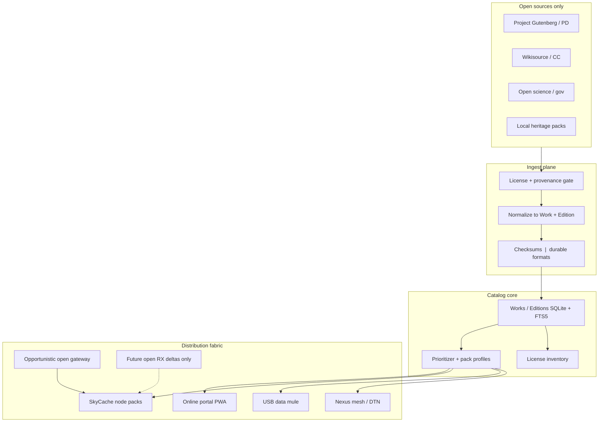

# Skybrary architecture proposal

**Status:** Architecture proposal (Phase S0 planning -> S1 scaffolding)  
**Builds on:** SkyCache 0.4.x (Nexus fabric + community UX)  
**Stack continuity:** Python 3.11+, FastAPI, SQLite, static PWA, modular plugins  

---

## 1. Current foundation (as-built map)

### What already works

| Capability | Location | Skybrary reuse |
|------------|----------|----------------|
| Content packages + `manifest.json` | `docs/content-packaging.md`, `skycache/packages/` | Base unit of offline distribution |
| SQLite catalog | `skycache/db/` | Extend with *works* / editions / text metadata |
| Prioritizer classes | `skycache/policy/prioritizer.py` | Add archive tiers (civilizational canon, literacy, STEM, local heritage) |
| Search (title/tags) | `skycache/community/search.py` | Foundation for full-text + faceted search |
| License inventory | `skycache/community/licenses.py` | Strengthen provenance for texts |
| Nexus mesh/DTN/gateway | `skycache/nexus/` | Distribution fabric for archive deltas |
| Offline PWA | `webui/` | Dual-access portal (online marketing + offline node UI) |
| Legal rails | `config.py`, `legal-ethics.md` | Non-negotiable for all ingest |
| Sim multi-node | `nexus/sim.py` | CI without RF / without huge corpora |

### Gaps to close for Skybrary

1. **Work-centric catalog** (book/article identity vs one-off "packs")  
2. **Text-native ingest** (EPUB, plain text, PDF/A, Markdown) with checksums  
3. **Faceted browse** (language, era, subject, license, collection)  
4. **Full-text search** suitable for low-power SQLite (FTS5)  
5. **Corpus pipelines** for Project Gutenberg - class open sets  
6. **Online portal** experience that feels like a modern open library (still lightweight)  
7. **Archive pack profiles** (e.g. "1 GB literacy kit", "5 GB STEM kit") for constrained nodes  
8. **Integrity** (SHA-256 per file, optional signatures later)  
9. **Honest scale** - never pretend the full north star is complete  

---

## 2. Target architecture



### Layers

1. **Source adapters** - one plugin family per corpus (Gutenberg, folder of EPUBs, open JSON feeds). All fail closed on license.  
2. **Legal gate** - extend `validate_source_name` + package-level license schema + optional SPDX.  
3. **Work model** - stable `work_id` (title+author+language fingerprint), multiple `edition_id`s (formats).  
4. **Storage** - content dir layout preserves packages; large libraries may use content-addressed blobs under `data/skybrary/blobs/sha256/...`.  
5. **Search** - SQLite FTS5 for offline; online portal may use same DB export or static search index for static hosting.  
6. **Prioritizer** - Emergency/Health remain supreme; new archive classes sit under education/general with *civilizational value scores*.  
7. **Pack profiles** - declarative YAML/JSON selecting works by tags/language/size budget.  
8. **Distribution** - reuse Nexus fabric; archive *deltas* are just high-priority content packages.  
9. **Online portal** - marketing site + optional hosted catalog mirror; node PWA remains offline-capable.  

---

## 3. Data model (proposal)

### Work

| Field | Purpose |
|-------|---------|
| `work_id` | Stable identifier |
| `title` | Multilingual dict |
| `creators` | Authors / editors |
| `languages` | ISO codes |
| `subjects` | Facets (science, literature, ...) |
| `era` | optional period label |
| `license` | SPDX or short form |
| `provenance` | source corpus + URL + retrieved_at |
| `civilizational_tier` | 1 - 5 heuristic for prioritization |
| `checksum_root` | aggregate integrity |

### Edition

| Field | Purpose |
|-------|---------|
| `edition_id` | Specific format instance |
| `work_id` | Parent |
| `format` | `txt` \| `epub` \| `pdf` \| `md` \| `html` |
| `path` | Relative storage path |
| `size_bytes` | Size |
| `sha256` | File integrity |
| `priority_class` | Maps into existing prioritizer |

### Pack profile

```yaml
# example: profiles/literacy-1gb.yaml
id: literacy-1gb
max_bytes: 1000000000
languages: [en, fr, es, ar, sw, hi, pt]
include_subjects: [literacy, literature_pd, health_edu]
prefer_formats: [epub, txt, html]
```

Compatible with existing `manifest.json` package export for nodes.

---

## 4. Prioritization for knowledge resilience

Existing order remains:

`emergency > health > education > agriculture > maps > weather > general > telemetry_raw`

Skybrary adds **within-class** scoring:

| Signal | Weight idea |
|--------|-------------|
| Civilizational tier (foundational literacy, basic medicine, open science) | High |
| Language match to community preferred languages | High |
| Size efficiency (knowledge density / byte) | Medium |
| Freshness (for evolving open science) | Medium |
| Local heritage pin | Highest when operator pins |

Disaster mode (already in Nexus) continues to flood emergency/health first - archives never starve critical survival content.

---

## 5. Dual access design

### Online (connected users)

- Global marketing + plan: skycache.jonbailey.xyz `/skybrary`  
- Future: catalog browse/search of open works; download pack profiles  
- Static-export friendly where possible (Cloudflare Pages class hosting)  

### Offline (SkyCache nodes)

- Same prioritizer + package format  
- USB mule + mesh gossip + opportunistic gateway pulls of open packs  
- PWA search/boards already present (0.4); extend with library facets  

---

## 6. Preservation strategy

| Practice | Approach |
|----------|----------|
| Formats | Prefer plain text, EPUB, Markdown, PDF/A when available |
| Dedup | SHA-256 content addressing |
| Versioning | Edition rows; never silently overwrite without new edition_id |
| Bit rot | Periodic checksum verify: `skycache skybrary doctor --verify` or `skycache verify data/content` (schedule weekly; see below) |
| Maintainability | Small modules; no mandatory cloud; volunteer-operable docs |

---

## 7. Module map (proposed code)

```text
skycache/skybrary/
  __init__.py
  models.py          # Work, Edition, PackProfile
  catalog.py         # SQLite works + FTS5
  license_gate.py    # Fail-closed open licenses
  corpus_import.py   # Folder .txt/.epub + allowlisted open URL (Wave 2.B2)
  sample_corpus.py   # Curated PD samples
  pack_profile.py    # Build node packs under size budget
  integrity.py       # sha256 verify
  ingest.py          # Package -> works FTS
```

Distribution continues via existing Nexus + package_import; Skybrary does not reimplement mesh.

### License passport (Wave 2.D1)

Every package and work exposes a machine-readable **license passport**:

| Field | Meaning |
|-------|---------|
| `license` | Declared license string |
| `provenance` | Source type, optional URL, legal note |
| `retrieval_date` | When the node received the pack/edition |
| `sha256` | Primary content digest when known |
| `redistribute` | `yes` / `no` / `review` + human note |

API:

- `GET /api/packages/{id}/passport` - optional `?verify=true` runs on-disk integrity
- `GET /api/skybrary/works/{id}/passport` - same for Skybrary works

PWA shows a **Passport** chip on library and package cards; tap opens the sheet (no third-party analytics).

### Integrity / bit-rot schedule (Wave 3.B5)

Operators should run a weekly integrity pass on the content tree (Pi/solar nodes: off-peak).

```bash
# Full content tree (packages with manifest.json)
skycache verify data/content

# Or via Skybrary doctor (catalog check + tree verify)
skycache skybrary doctor --verify
# JSON report: skycache skybrary doctor --verify --json
```

Example cron (Linux node, Sundays 03:30 local):

```cron
30 3 * * 0  cd /opt/skycache && /usr/bin/skycache verify data/content >> /var/log/skycache-verify.log 2>&1
```

Exit code non-zero means missing files or hash drift - re-ingest from USB mule or known-good packs.

---

## 8. Trade-offs

| Decision | Choice | Why | Cost |
|----------|--------|-----|------|
| Extend SkyCache vs new monorepo | Extend | Continuity, legal rails, field hardware | Some naming dualism (SkyCache node / Skybrary mission) |
| SQLite FTS5 vs external search | FTS5 first | Offline + low power | Scale limits -> shard later |
| Host full PD corpus in git | Never | Repo size | Packs generated / downloaded separately |
| Online-only modern SPA | No | Offline-first | Portal must stay lightweight |
| "Complete archive" messaging | Forbidden | Honesty | Marketing discipline |

---

## 9. Security & trust

- Untrusted ingest paths; validate paths; no path traversal on serve  
- License gate before catalog insert  
- Forbidden commercial RF keywords unchanged  
- No PII harvest for "reader accounts" in MVP  

---

## 10. How this advances knowledge resilience

Every milestone must answer: **If the global internet vanished tomorrow, what open knowledge would this node still serve, and can a local maintainer keep it alive?**

Skybrary's architecture keeps that question first: dual access, prioritization, legal provenance, durable formats, and distribution that works when connectivity is intermittent or gone.

---

## Related

- Vision: [`VISION-SKYBRARY.md`](VISION-SKYBRARY.md)  
- Roadmap: [`skybrary-roadmap.md`](skybrary-roadmap.md)  
- As-built: [`architecture.md`](architecture.md)  
- Legal: [`legal-ethics.md`](legal-ethics.md)  
